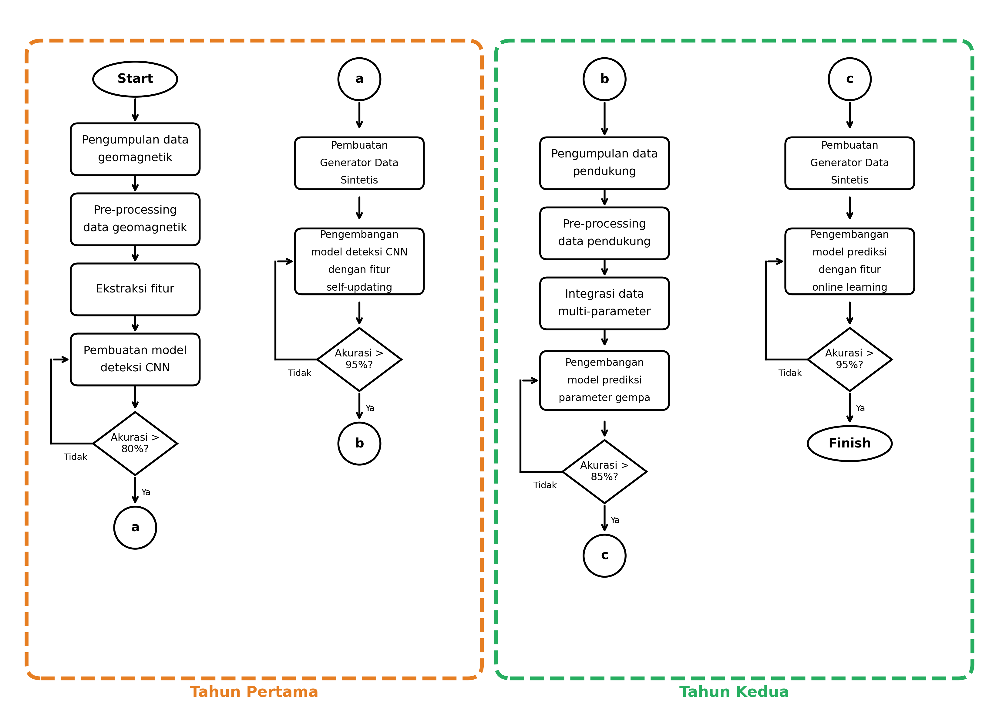

# Metodologi Penelitian

## 1. Desain Penelitian

Penelitian ini menggunakan pendekatan **Research and Development (R&D)** dengan fokus pada pengembangan sistem deteksi dan prediksi prekursor gempa bumi. Penelitian dilakukan dalam dua tahun dengan tahapan yang terstruktur.

---

## 2. Alur Penelitian

### 2.1 Flowchart Penelitian



### 2.2 Tahapan Penelitian

#### TAHUN PERTAMA

```
Start
  │
  ▼
┌─────────────────────────────┐
│ Pengumpulan Data Geomagnetik│
│ - 25 stasiun BMKG           │
│ - Komponen H, D, Z          │
│ - Periode 2018-2025         │
└─────────────────────────────┘
  │
  ▼
┌─────────────────────────────┐
│ Pre-processing Data         │
│ - Filtering PC3 (10-45 mHz) │
│ - Perhitungan Z/H ratio     │
│ - Quality control           │
└─────────────────────────────┘
  │
  ▼
┌─────────────────────────────┐
│ Ekstraksi Fitur             │
│ - STFT Transform            │
│ - Spectrogram 224×224       │
│ - Normalization             │
└─────────────────────────────┘
  │
  ▼
┌─────────────────────────────┐
│ Pembuatan Model CNN         │
│ - EfficientNet-B0           │
│ - Multi-task learning       │
│ - Transfer learning         │
└─────────────────────────────┘
  │
  ▼
◇ Akurasi > 80%? ◇───No──→ [Iterasi]
  │
  Yes
  │
  ▼
┌─────────────────────────────┐
│ Generator Data Sintetis     │
│ - SMOTE augmentation        │
│ - Class balancing           │
└─────────────────────────────┘
  │
  ▼
┌─────────────────────────────┐
│ Model Self-Updating         │
│ - Auto-update pipeline      │
│ - Champion-challenger       │
│ - Model versioning          │
└─────────────────────────────┘
  │
  ▼
◇ Akurasi > 95%? ◇───No──→ [Iterasi]
  │
  Yes
  │
  ▼
[Lanjut Tahun 2]
```

#### TAHUN KEDUA

```
[Dari Tahun 1]
  │
  ▼
┌─────────────────────────────┐
│ Pengumpulan Data Pendukung  │
│ - Data seismik              │
│ - Data ionosfer             │
│ - Data GPS/GNSS             │
└─────────────────────────────┘
  │
  ▼
┌─────────────────────────────┐
│ Pre-processing Data         │
│ Pendukung                   │
└─────────────────────────────┘
  │
  ▼
┌─────────────────────────────┐
│ Integrasi Multi-Parameter   │
│ - Feature fusion            │
│ - Multi-modal learning      │
└─────────────────────────────┘
  │
  ▼
┌─────────────────────────────┐
│ Model Prediksi Parameter    │
│ Gempa                       │
│ - Magnitude prediction      │
│ - Location (Azimuth)        │
│ - Time window prediction    │
│ - Multi-task EfficientNet   │
└─────────────────────────────┘
  │
  ▼
◇ Akurasi > 85%? ◇───No──→ [Iterasi]
  │
  Yes
  │
  ▼
┌─────────────────────────────┐
│ Generator Data Sintetis     │
│ (untuk data pendukung)      │
└─────────────────────────────┘
  │
  ▼
┌─────────────────────────────┐
│ Model Online Learning       │
│ - Incremental learning      │
│ - Continual adaptation      │
│ - Real-time update          │
└─────────────────────────────┘
  │
  ▼
◇ Akurasi > 95%? ◇───No──→ [Iterasi]
  │
  Yes
  │
  ▼
Finish
```

---

## 3. Data Penelitian

### 3.1 Data Geomagnetik

| Arsitektur | EfficientNet-B0 Hierarkis |
| Konfigurasi | Multi-head for detection/mag/azi |
| Periode | 2018-2025 |

### 3.2 Daftar Stasiun Magnetometer

| No | Kode | Nama Stasiun | Koordinat |
|----|------|--------------|-----------|
| 1 | SCN | Sicincin | -0.55°, 100.28° |
| 2 | GTO | Gorontalo | 0.52°, 123.06° |
| 3 | TRT | Ternate | 0.77°, 127.37° |
| 4 | MLB | Melaboh | 4.14°, 96.13° |
| 5 | GSI | Gunungsitoli | 1.28°, 97.58° |
| ... | ... | ... | ... |

### 3.3 Data Gempa Bumi

| Parameter | Spesifikasi |
|-----------|-------------|
| Sumber | Katalog BMKG |
| Periode | 2018-2025 |
| Magnitude | M ≥ 5.0 |
| Jumlah Event | 105+ (M ≥ 6.0) |
| Parameter | Waktu, Lokasi, Kedalaman, Magnitude |

---

## 4. Preprocessing Data

### 4.1 Filtering

```python
# Bandpass filter untuk PC3 (10-45 mHz)
from scipy.signal import butter, filtfilt

def bandpass_filter(data, lowcut=0.01, highcut=0.045, fs=1.0, order=4):
    nyq = 0.5 * fs
    low = lowcut / nyq
    high = highcut / nyq
    b, a = butter(order, [low, high], btype='band')
    return filtfilt(b, a, data)
```

### 4.2 Perhitungan Z/H Ratio

```python
def calculate_zh_ratio(z_component, h_component):
    """
    Menghitung rasio Z/H per jam
    Anomali ditandai dengan Z/H > threshold
    """
    # Power spectral density
    psd_z = np.abs(np.fft.fft(z_component))**2
    psd_h = np.abs(np.fft.fft(h_component))**2
    
    # Z/H ratio
    zh_ratio = np.sqrt(psd_z / psd_h)
    return zh_ratio
```

### 4.3 Generasi Spektrogram

```python
from scipy.signal import stft

def generate_spectrogram(signal, fs=1.0, nperseg=256):
    """
    Generate spectrogram menggunakan STFT
    Output: 224×224 pixels untuk input CNN
    """
    f, t, Zxx = stft(signal, fs=fs, nperseg=nperseg)
    spectrogram = np.abs(Zxx)
    
    # Resize ke 224×224
    spectrogram_resized = resize(spectrogram, (224, 224))
    return spectrogram_resized
```

---

## 5. Arsitektur Model

### 5.1 EfficientNet-B0 (Tahun 1)

```
Input: Spectrogram 224×224×3
    │
    ▼
┌─────────────────────────────┐
│ EfficientNet-B0 Backbone    │
│ (Pre-trained ImageNet)      │
│ Output: 1280 features       │
└─────────────────────────────┘
    │
    ├──────────────┬──────────────┐
    ▼              ▼              ▼
┌────────┐   ┌────────┐    ┌────────┐
│ FC 512 │   │ FC 512 │    │ FC 512 │
│Azimuth │   │  Mag   │    │ Binary │
└────────┘   └────────┘    └────────┘
```

### 5.2 Spesifikasi Model

| Parameter | Nilai |
|-----------|-------|
| Backbone | EfficientNet-B0 |
| Input Size | 224×224×3 |
| Total Parameters | ~5.3M |
| Model Size | ~20 MB |
| Optimizer | AdamW |
| Learning Rate | 1e-4 |
| Batch Size | 32 |
| Epochs | 30 |

---

## 6. Metode Validasi

### 6.1 Leave-One-Event-Out (LOEO)

```
Dataset: N events
For i = 1 to N:
    Test set = Event[i]
    Train set = All events except Event[i]
    Train model on Train set
    Evaluate on Test set
    Record metrics

Final metrics = Average of all folds
```

### 6.2 Metrik Evaluasi

| Metrik | Formula | Target |
|--------|---------|--------|
| Accuracy | (TP+TN)/(TP+TN+FP+FN) | > 95% |
| Precision | TP/(TP+FP) | > 90% |
| Recall | TP/(TP+FN) | > 90% |
| F1-Score | 2×(P×R)/(P+R) | > 90% |
| MCC | Matthews Correlation Coefficient | > 0.85 |

### 6.3 Interpretabilitas (Grad-CAM)

```python
def generate_gradcam(model, input_image, target_layer):
    """
    Generate Grad-CAM heatmap untuk interpretasi
    Memvalidasi bahwa model fokus pada frekuensi ULF
    """
    # Forward pass
    features = model.get_features(input_image)
    output = model(input_image)
    
    # Backward pass
    output.backward()
    gradients = model.get_gradients()
    
    # Generate heatmap
    weights = gradients.mean(dim=[2, 3])
    cam = (weights @ features).relu()
    
    return cam
```

---

## 7. Self-Updating Pipeline (Tahun 1)

### 7.1 Arsitektur Pipeline

```
┌─────────────────────────────────────────────────────┐
│                 Auto-Update Pipeline                 │
├─────────────────────────────────────────────────────┤
│                                                      │
│  ┌──────────┐    ┌──────────┐    ┌──────────┐      │
│  │   Data   │───▶│ Trainer  │───▶│Evaluator │      │
│  │Ingestion │    │          │    │          │      │
│  └──────────┘    └──────────┘    └──────────┘      │
│                                        │            │
│                                        ▼            │
│  ┌──────────┐    ┌──────────┐    ┌──────────┐      │
│  │ Deployer │◀───│Comparator│◀───│Challenger│      │
│  │          │    │          │    │  Model   │      │
│  └──────────┘    └──────────┘    └──────────┘      │
│        │                                            │
│        ▼                                            │
│  ┌──────────┐                                       │
│  │Production│                                       │
│  │  Model   │                                       │
│  └──────────┘                                       │
│                                                      │
└─────────────────────────────────────────────────────┘
```

### 7.2 Champion-Challenger Strategy

1. **Champion**: Model EfficientNet-B0 yang saat ini operasional
2. **Challenger**: Model EfficientNet-B0 versi baru dengan optimasi hyperparameter
3. **Comparison**: Evaluasi kedua model pada test set yang sama
4. **Decision**: Deploy challenger jika performanya lebih baik

---

## 8. Online Learning (Tahun 2)

### 8.1 Konsep

```
┌─────────────────────────────────────────────────────┐
│                  Online Learning                     │
├─────────────────────────────────────────────────────┤
│                                                      │
│  Real-time Data ──▶ Buffer ──▶ Incremental Update   │
│                                        │            │
│                                        ▼            │
│                              ┌──────────────┐       │
│                              │ Model Update │       │
│                              │ (No full     │       │
│                              │  retraining) │       │
│                              └──────────────┘       │
│                                        │            │
│                                        ▼            │
│                              ┌──────────────┐       │
│                              │  Validation  │       │
│                              │  & Deploy    │       │
│                              └──────────────┘       │
│                                                      │
└─────────────────────────────────────────────────────┘
```

### 8.2 Teknik yang Digunakan

1. **Elastic Weight Consolidation (EWC)**: Mencegah catastrophic forgetting
2. **Experience Replay**: Menyimpan sampel penting dari data lama
3. **Progressive Neural Networks**: Menambah kapasitas model secara bertahap

---

## 9. Tools dan Environment

### 9.1 Hardware

| Komponen | Spesifikasi |
|----------|-------------|
| GPU | NVIDIA RTX 3080 / A100 |
| RAM | 32 GB |
| Storage | 1 TB SSD |

### 9.2 Software

| Software | Versi |
|----------|-------|
| Python | 3.10+ |
| PyTorch | 2.0+ |
| CUDA | 11.8+ |
| Streamlit | 1.28+ |

### 9.3 Libraries

```
torch>=2.0.0
torchvision>=0.15.0
numpy>=1.24.0
pandas>=2.0.0
scipy>=1.10.0
matplotlib>=3.7.0
scikit-learn>=1.2.0
streamlit>=1.28.0
paramiko>=3.0.0
```
