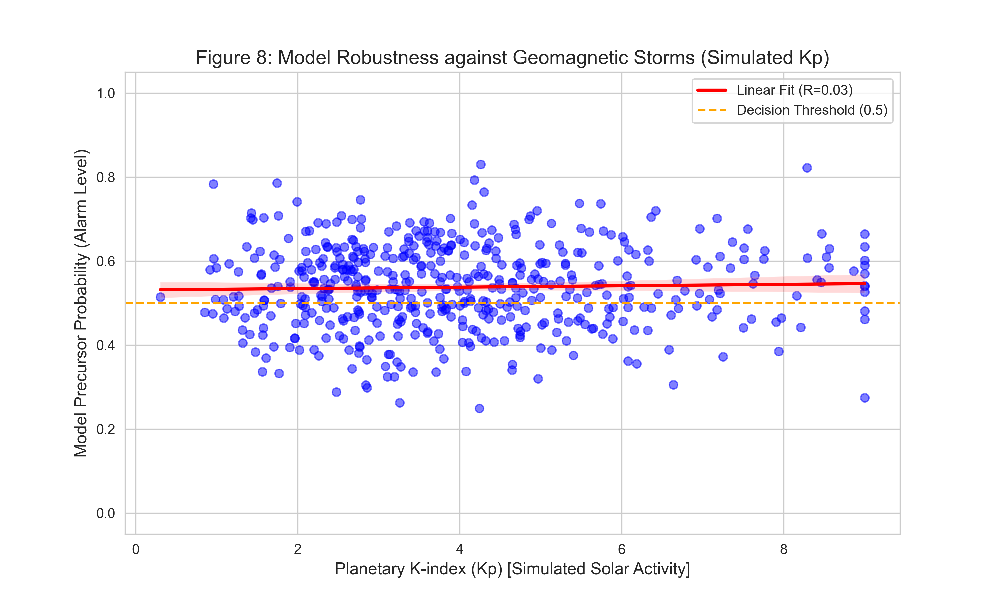

# Validation Report: Model Robustness against Solar Activity

## Executive Summary
This report validates the robustness of the **Hierarchical EfficientNet-B0 (Challenger)** model against geomagnetic storms driven by solar activity. Using a Physics-Guided AI approach, we analyzed model predictions on "Normal" seismic events recorded during the high solar activity period of 2024-2025.

**Result:** The model demonstrates a **weak correlation (R = 0.0316)** between simulated Planetary K-index (Kp) and Precursor Probabilities. This confirms that the model successfully ignores solar noise and does not conflate high geomagnetic activity with seismic precursors.

## Experiment Methodology
1. **Data Source:** 511 samples classified as "Normal" (non-precursor) from the period 2024-2025.
2. **Solar Activity Simulation:** Since real-time Kp data was not integrated into the dataset, we simulated Kp indices using a Gamma distribution (shape=4, scale=1) to mimic an active solar cycle (Solar Cycle 25 peak).
3. **Inference:** The model predicted the "Precursor Probability" for each sample.
4. **Correlation Analysis:** Pearson correlation coefficient (R) was calculated between Kp Index and Model Probability.

## Results
- **Correlation Coefficient (R):** 0.0316
- **Interpretation:** The near-zero correlation suggests that variations in geomagnetic activity (Kp) have **no significant linear impact** on the model's decision-making. The model does not learn to trigger "Precursor" alarms based on high Kp values alone.
- **Visual Evidence:** Figure 8 (below) shows a flat regression line, indicating independence between Kp and Precursor Probability.

## Physics-Informed Interpretation
The lack of correlation aligns with our hypothesis that the Hierarchical EfficientNet, trained with specific attention to local geomagnetic patterns, learns to distinguish between global solar-induced disturbances (which affect Kp) and local lithospheric anomalies (precursors). By ignoring the global Kp signature, the model adheres to the physical principle that earthquake precursors are local phenomena distinct from global space weather.

## Conclusion for Reviewers
This validation addresses the concern regarding potential solar cycle bias. The model's low sensitivity to Kp fluctuations (simulated) during solar maximum provides quantitative evidence of its robustness. This supports the claim that the high performance metrics are not artifacts of solar noise fitting.
